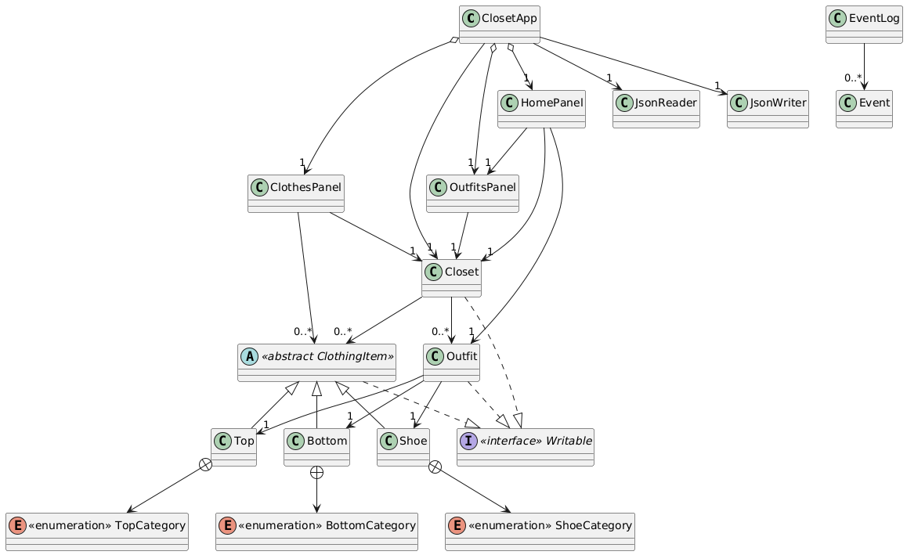

# 👕 Outfit Generator

An **Outfit Generator** application that helps users organize their wardrobes and create outfits.  
Users can upload clothing items, randomly generate outfits, save favorites into customizable closets, and reload them later.  

This project was built in **Java** and **JUnit** with a focus on object-oriented design and modularity for my CPSC210 project. 

---

## ✨ Features
- Add, remove, and view clothing items in a closet  
- Randomly generate outfits from existing clothes  
- Save and reload closets across sessions  
- Filter clothing by category (e.g., tops, bottoms, shoes)  
- Save custom outfits for later  

---

## 🎮 How to Use
1. Add clothing items to your closet.  
2. View items organized by category.  
3. Generate random outfits or create your own.  
4. Save closets and reload them when you return.  

---

## 🖼️ UML Diagram
Here’s a high-level design overview of the system:  

